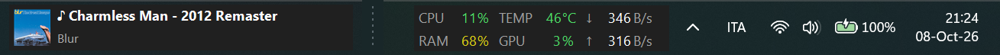
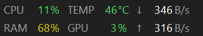
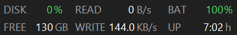
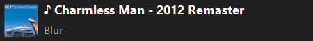
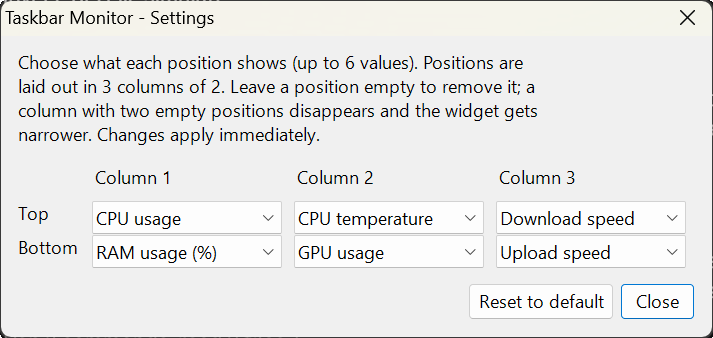
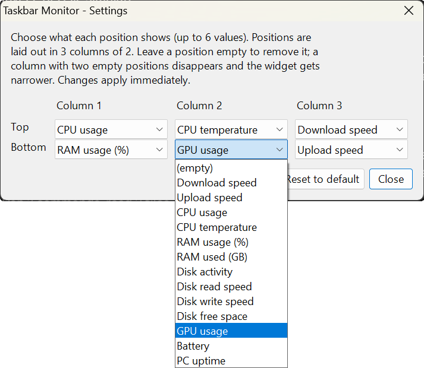

# Taskbar Monitor

**Website: [alessandrozappatore.github.io/TaskbarMonitor](https://alessandrozappatore.github.io/TaskbarMonitor/)** · [Download](../../releases/latest) · [FAQ](https://alessandrozappatore.github.io/TaskbarMonitor/faq/)

A tiny, free and open-source Windows overlay that shows **live network speed, CPU, RAM, CPU temperature and the currently playing track** right on your taskbar.

- Single ~37 KB executable, no installer, no runtime to install
- Uses ~60 MB of RAM and practically 0% CPU
- No network access, no telemetry, no accounts



| Stats widget (6 values) | Another setup (disk, battery, uptime) |
| --- | --- |
|  |  |



## Features

| Overlay | What it shows |
| --- | --- |
| **Stats** (bottom right, next to the system tray) | Up to 6 values that **you choose**: network speed, CPU, temperature, RAM, disk, GPU, battery, uptime (see [Choosing what to show](#choosing-what-to-show)) |
| **Now playing** (bottom left) | Cover art, title and artist of whatever is playing (Spotify, YouTube in the browser, VLC, ...). Click it to play/pause |

- Fixed-position columns: values never jump around when they change.
- Values are color-coded from green to yellow to red depending on load and temperature.
- Follows the Windows light/dark theme.
- Sharp text on high-DPI screens.
- The stats overlay can be dragged anywhere; its position is remembered.
- Optional **Start with Windows**.
- Only one instance runs at a time.
- **Hide / show** the widgets any time (see below).

## Download

1. Go to the [**Releases**](../../releases/latest) page.
2. Download `TaskbarMonitor.exe`.
3. Put it anywhere you like (for example `C:\Tools\TaskbarMonitor\`) and double-click it.

> **Windows SmartScreen:** the executable is not code-signed, so Windows may show a
> "Windows protected your PC" warning. Click **More info** then **Run anyway**.
> If you prefer, you can read the (small) source in [`src/`](src/) and
> [build it yourself](#build-from-source) in a few seconds.

## Usage

Right-click either overlay (or the tray icon next to the clock) to open the menu:

- **Settings...**: choose what the stats widget shows (see below).
- **Hide widgets** / **Show widgets**: hides or restores both overlays.
- **Start with Windows**: toggles automatic startup (stored in the current user's `Run` registry key).
- **Show now playing**: shows or hides the now-playing overlay.
- **Reposition on taskbar**: resets the stats overlay to its default place.
- **Exit**: closes the app.

Drag the stats overlay with the left mouse button to move it. Left-click the now-playing overlay to play/pause.

If you move the `.exe` to another folder after enabling *Start with Windows*, toggle the option off and on again so the startup entry points to the new location.

### Choosing what to show

Open **Settings...** from the menu. The stats widget has **6 positions**, laid out in 3 columns of 2. Pick any value for each position, or leave it empty. Changes apply immediately.

| Settings window | Every available value |
| --- | --- |
|  |  |
 A column with two empty positions disappears and the widget gets narrower, so it never takes more space than it needs. Labels and units change with the value you pick.

| Value | Shown as |
| --- | --- |
| Download / upload speed | `↓ 264 B/s`, `↑ 1.2 MB/s` |
| CPU usage | `CPU 12%` |
| CPU temperature | `TEMP 53°C` |
| RAM usage / RAM used | `RAM 65%` / `RAM 10.6 GB` |
| Disk activity, read speed, write speed | `DISK 3%`, `READ 44.0 KB/s`, `WRITE 128.1 KB/s` |
| Disk free space (system drive) | `FREE 131 GB` |
| GPU usage | `GPU 7%` |
| Battery | `BAT 85%` (green when plugged in, red when low) |
| PC uptime | `UP 6:45 h` or `UP 3d 4 h` |

Each value can appear only once: choosing one that is already used swaps the two positions. Percentages, temperature and battery change color from green to yellow to red. Only the values you select are measured, so the others cost nothing. The default is CPU, RAM, temperature, download and upload.

### Hiding and showing the widgets

Choose **Hide widgets** in the menu to hide both overlays. Taskbar Monitor keeps running and its icon stays in the notification area (click the `^` arrow next to the clock if the icon is in the overflow; drag it onto the taskbar to keep it always visible). You can bring the widgets back in any of these ways:

- **Click the tray icon** (it toggles hide/show).
- Press **Ctrl + Alt + M** (toggles hide/show).
- **Open `TaskbarMonitor.exe` again**: if it is already running, it just shows the widgets.
- Right-click the tray icon and choose **Show widgets**.

A balloon reminds you how to restore them when you hide. If you hide the widgets and restart Windows, they stay hidden when started automatically; launching the app manually always shows them.


## Requirements

- Windows 10 (version 1809 or newer) or Windows 11, 64-bit
- .NET Framework 4.x (already included in Windows)

## Build from source

No SDK or Visual Studio needed: the compiler (`csc.exe`) ships with Windows.

```bat
git clone https://github.com/AlessandroZappatore/TaskbarMonitor.git
cd TaskbarMonitor
build.bat
```

This produces `TaskbarMonitor.exe` in the repository folder.

## How it works

- **Network speed**: byte counters of all active, non-loopback network interfaces, sampled every second.
- **CPU / RAM**: `GetSystemTimes` and `GlobalMemoryStatusEx` (Win32).
- **Disk**: the *PhysicalDisk* performance counters (activity, read and write bytes per second) and free space of the system drive.
- **GPU**: the *GPU Engine* performance counters, taking the busiest engine type like Task Manager does. Shown as `--` if Windows does not expose them.
- **Battery / uptime**: Windows power status and `GetTickCount64`.
- **CPU temperature**: the *Thermal Zone Information* performance counter (ACPI thermal zones). This is the temperature reported by the system, **not** a per-core reading, so it can differ from tools like HWiNFO or HWMonitor. If your machine does not expose a thermal zone, the value is shown as `--`.
- **Now playing**: the Windows *System Media Transport Controls* (the same API behind the media flyout and keyboard media keys), so any app that integrates with it works.
- **Overlay**: a borderless, non-activating, always-on-top window owned by the taskbar window. Windows 11 no longer supports third-party taskbar toolbars, so an overlay is the most reliable approach. Because Windows always keeps an owned window above its owner, the overlay rises together with the taskbar when the Start menu or other flyouts open, without polling the z-order (no flicker). If Explorer restarts, the overlay re-attaches automatically.

## Privacy

Taskbar Monitor does not connect to the internet, collects nothing, and sends nothing. It only stores two things locally:

- its window position and the now-playing toggle under `HKEY_CURRENT_USER\Software\TaskbarMonitor`
- (optionally) the startup entry under `HKEY_CURRENT_USER\Software\Microsoft\Windows\CurrentVersion\Run`

## Uninstall

1. Right-click the overlay and turn **Start with Windows** off, then choose **Exit**.
2. Delete `TaskbarMonitor.exe`.
3. Optionally delete the registry key `HKEY_CURRENT_USER\Software\TaskbarMonitor`.

## Known limitations

- Temperature is the system thermal zone, not an exact per-core value.
- Only the primary monitor is supported.
- The overlays sit on top of the taskbar, so they can cover taskbar items under them (for example the Widgets button on the left). Hide the now-playing overlay from the menu if that bothers you.
- Cover art depends on what the playing app provides.

## Contributing

Issues and pull requests are welcome. See [CONTRIBUTING.md](CONTRIBUTING.md).

## License

Released under the [MIT License](LICENSE). Free to use, modify and distribute.
